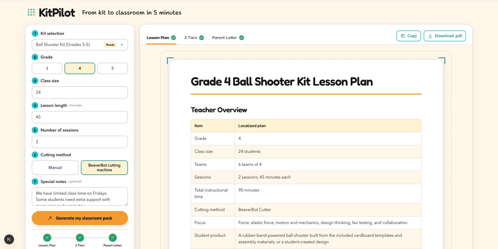
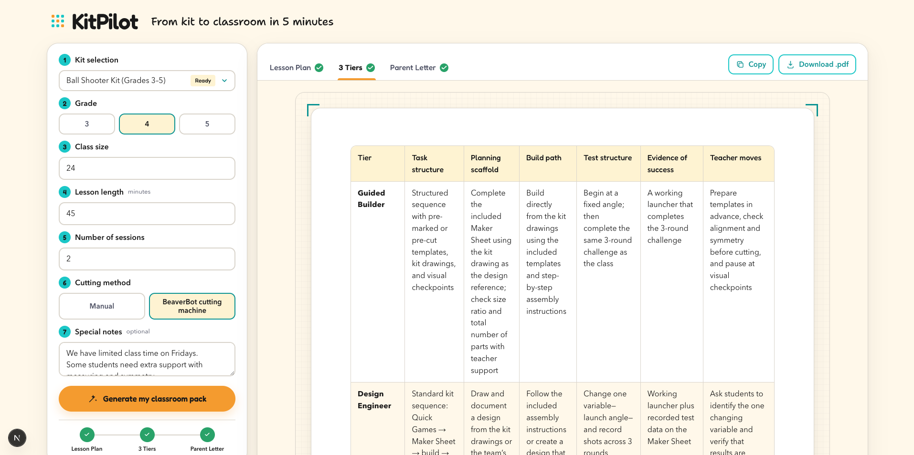
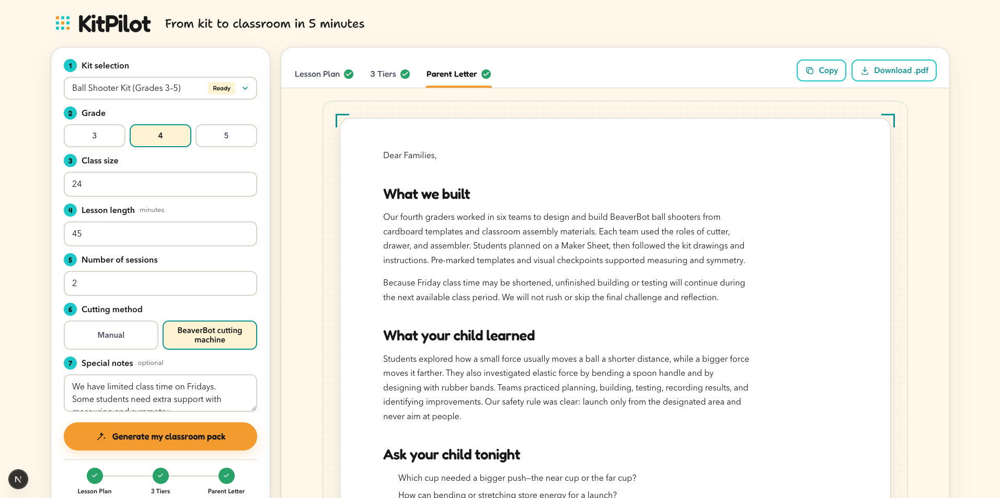
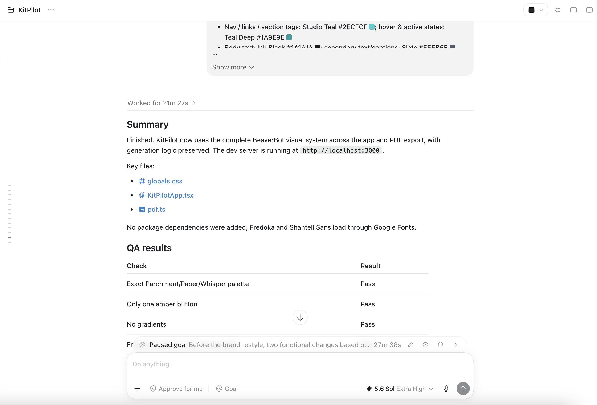

# KitPilot

KitPilot turns the BeaverBot Ball Shooter Kit into a classroom-ready lesson plan, three task-structure differentiation tiers, and a parent letter.

Built for **OpenAI Build Week 2026** (Education track) by BeaverBot, a STEAM education kit brand.

## How Codex & GPT-5.6 were used

- **GPT-5.6 (Responses API)** generates every classroom document at runtime: the lesson plan, the three differentiation tiers, and the parent letter. All calls run server-side, grounded in the YAML knowledge base extracted from the kit's official curriculum (`ball-shooter-knowledge.md`), under strict content contracts (`lib/prompts.ts`) that forbid inventing build steps, materials, or slide content.
- **Codex** built this entire application from a written product spec and acceptance criteria: the Next.js app, the sequential streaming generation pipeline, the deterministic output guards, the print-ready PDF export, and the BeaverBot brand restyle. A session screenshot is in `codex_session.png`.

## Screenshots

### Lesson Plan

Shows classroom constraints translated into team math, materials, and a timed lesson flow.



### 3 Tiers

Shows three task structures compared side by side for one mixed-ability classroom.



### Parent Letter

Shows a warm, jargon-free family summary with conversation starters for home.



### Built with Codex



## Run locally

KitPilot requires **Node.js 20.9.0 or newer** (the minimum supported by Next.js 16.2.10).

```bash
npm install
npm run dev
```

The app, `npm install`, and `npm run build` work without an OpenAI API key. Only the **Generate** action requires one; without it, KitPilot stays usable and reports `OPENAI_API_KEY is not configured on the server` when generation is attempted.

To enable generation, copy the environment template and set `OPENAI_API_KEY` in `.env.local`:

```bash
cp .env.example .env.local
```

The key is read only by the server-side API route.

**Data handling:** Classroom inputs are sent to the OpenAI API for generation and are not persisted by KitPilot. Do not include student names or personal data.

## Architecture

- `app/api/generate/route.ts` streams a sequential three-call GPT-5.6 pipeline as newline-delimited JSON.
- `app/api/download/route.ts` validates document downloads and returns the generated file as `application/pdf`.
- `lib/knowledge.ts` loads only the YAML block from `ball-shooter-knowledge.md` and injects it into every model call.
- `lib/prompts.ts` contains the strict lesson plan, differentiation, and parent-letter generation contracts.
- `lib/output-guards.ts` moves an existing tier comparison table to the top and trims eligible parent-letter prose toward a 240-word target.
- `lib/pdf.ts` renders generated Markdown into a print-friendly PDF on the server.
- `components/KitPilotApp.tsx` renders the single-page form, per-tab progress states, copy actions, and PDF download actions.
